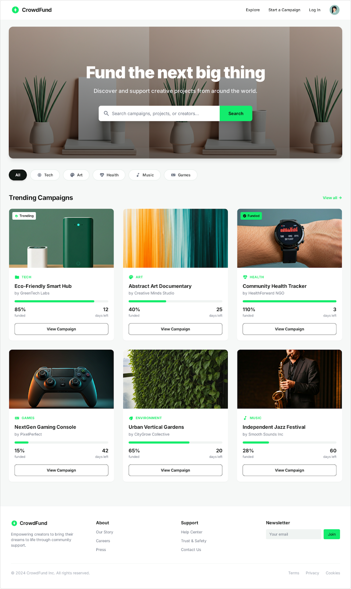

# Crowdfunding Platform

A full-stack simulation of a crowdfunding ecosystem built with Vanilla JavaScript. This platform facilitates the creation, management, and funding of innovative campaigns while providing administrative tools for platform moderation.



## Project Timeline
* **Status:** In Development
* **Deadline:** 17-01-2026

## Project Overview
This project simulates a real-world crowdfunding system where users can launch projects and backers can provide financial support. The backend is powered by a mock REST API using JSON Server and JSON Server Auth to handle data persistence and security.

### Key Features
* **Campaign Lifecycle:** Complete flow from creation and image upload to approval and funding.
* **Role-Based Access Control:** Distinct functionality for Admins, Registered Users, and Anonymous Visitors.
* **Moderation System:** Admin dashboard to manage user status and campaign validity.
* **Media Handling:** Image uploads handled via Base64 encoding for storage within the JSON database.

---

## User Roles and Feature Breakdown

### 1. Admin
Admins are responsible for maintaining the integrity of the platform through a dedicated management dashboard.
* **User Management:** View all registered users and ban/unban accounts by toggling the `isActive` boolean.
* **Campaign Moderation:** Review submitted campaigns and approve or reject them using the `isApproved` flag.
* **Data Access:** Full CRUD (Create, Read, Update, Delete) capabilities across `/users`, `/campaigns`, and `/pledges`.

### 2. Registered User
Authenticated users can interact with the platform as both creators and supporters.
* **Campaign Creation:** Launch new projects with titles, descriptions, goals, and deadlines.
* **Image Uploads:** Support for project visuals via Base64 string encoding.
* **Support System:** Ability to pledge funds to active campaigns and track personal contributions.
* **Profile Management:** View personal dashboard containing authored campaigns and pledged projects.

### 3. Anonymous Visitor
* **Browsing:** View all campaigns that have been approved by an administrator.
* **Search:** Filter projects by category or search by specific keywords.

---

## Technical Stack

### Frontend
* **HTML5:** Semantic structure for accessibility.
* **CSS3:** Custom styling using Flexbox and Grid.
* **JavaScript:** Vanilla ES6+ modules and Fetch API for asynchronous operations.

### Backend
* **JSON Server:** Mock REST API for database simulation.
* **JSON Server Auth:** Middleware for JWT-based authentication and route protection.

---

## Project Structure

```text
/
├── /html          # HTML pages and templates
├── /css           # Modular stylesheets
├── /js            # Frontend logic and API handlers
├── /assets        # Static images and icons
└── /backend       # Backend configuration
    ├── db.json    # Mock database storage
    └── server.js  # Optional custom server config

```

---

## Getting Started

### Installation

1. Clone the repository to your local machine.
2. Navigate to the `/backend` directory:
```bash
cd backend

```


3. Install the required dependencies:
```bash
npm install json-server json-server-auth

```


### Running the Project

1. Start the backend server:
```bash
json-server-auth db.json --port 3000

```


2. Open `/html/index.html` using a local development server (such as Live Server).

---

## API Documentation Reference

| Method | Endpoint | Access | Description |
| --- | --- | --- | --- |
| POST | /register | Public | Register a new user |
| POST | /login | Public | Authenticate and get JWT |
| GET | /campaigns?isApproved=true | Public | View approved campaigns |
| POST | /campaigns | Private | Create a project (Auth required) |
| PATCH | /users/:id | Admin | Update user status (isActive) |

---

## Design Reference

The UI/UX is based on the finalized Figma design. Key focus areas include mobile responsiveness, clear progress indicators for funding goals, and intuitive navigation.
